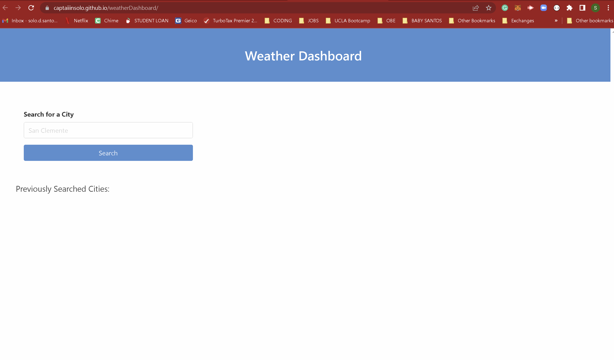

# Weather Dashboard

## Technology Used

| Technology Used         | Resource URL           | 
| ------------- |:-------------:| 
| HTML    | [MDN - HTML](https://developer.mozilla.org/en-US/docs/Web/HTML) | 
| JavaScript | [MDN - JS](https://developer.mozilla.org/en-US/docs/Web/JavaScript) |
| CSS     | [MDN - CSS](https://developer.mozilla.org/en-US/docs/Web/CSS) |   
| Git | [Git](https://git-scm.com/)|    
|jQuery | [jQuery Docs](https://api.jquery.com/) |
|Day.js | [Day.js Docs](https://day.js.org/docs/en/installation/installation) |
|Bulma CSS Framework | [Bulma Docs](https://bulma.io/documentation/) |

## Description

[Visit the deployed site here](https://captaiiinsolo.github.io/weatherDashboard/)

For this project, I created a dashboard for travelers to check the weather for the US cities they might be traveling to. Users can enter a city in the search and see the current weather and a five day forecast. Humidity percentage, wind speed, and an icon depicting the current conditions are all displayed once the search has completed. Searched cities are stored below the search form. Currently, the stored city buttons have no functionality but will be updated in the future to quickly display the previously searched cities forecasts.

## Usage

See the application in use via the GIF below.

## Author Information

Solomon Santos is currently a student at the UC Berkeley Coding Bootcamp for full stack web development, where he is expected to graduate in March 2023.

[LinkedIn](https://www.linkedin.com/in/solomon-santos)
[GitHub](https://www.github.com/captaiiinsolo)
[Twitter](https://twitter.com/captaiiinsolo)